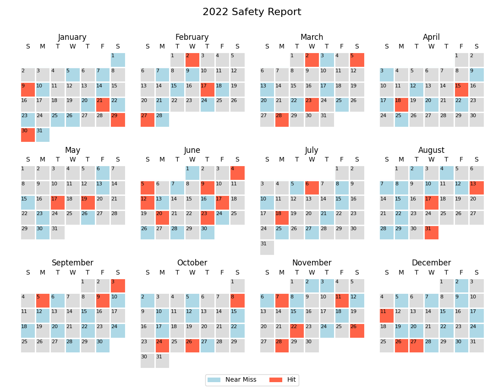

# calendarplot
Plot daily data on a 1-year calendar using Python and Pandas

This project is an adaptation of code posted by @SO_tourist on StackOverflow,
here:  
https://stackoverflow.com/a/61277350

It has not been developed into a full-fledged library at this stage.  I simply
collected it into a form that I find useful and am saving it here for posterity.
As such, the library is half-baked and you should expect to have to hack on it
a little to make it work for you.

## Requirements

- Python 3.6+
- Pandas
- Numpy
- Matplotlib

## Capabilities

The library supports heatmap mode as well as annotated days for defined values.
It will create a file with the given filename in any format supported by
Matplotlib.  The result will be fitted to a 8.5" x 11" page.

The provided Pandas DataFrame must be indexed by a date timestamp.  The values
must be numbers and they must be unique to each date.

## Usage

If you have the following data in CSV format:  

Date       | Value
---------- | -----
1/1/2022   | 1
1/5/2022   | 1
1/7/2022   | 1
1/9/2022   | 2
1/10/2022  | 1
1/14/2022  | 1
1/20/2022  | 1
1/21/2022  | 2
...        | ...

A calendar plot is generated as follows:

```
import pandas as pd

from calendarplot import create_year_calendar

df = pd.read_csv('data.csv')
df['Date'] = pd.to_datetime(df.Date)
df.set_index('Date', inplace=True)

hlmap = {0: ('gainsboro', None),
         1: ('lightblue', 'Near Miss'),
         2: ('tomato', 'Hit')}

create_year_calendar(df['Value'], 2022, '2022 Safety Report', 'example.png', hlmap=hlmap)
```



The plotting function supports the following options:

`create_year_calendar(df, year, title=None, filename=None, cmap='cool', hlmap={}, showcb=False, portrait=False)`

- `df` (required)  
  the Pandas DataFrame column with the data to plot
- `year` (required)  
  the calendar year to plot
- `title`  
  the title of the plot.  If `None`, set to "`year`"
- `filename`  
  the filename to save.  If `None`, set to "`title`.png"
- `cmap`  
  the matplotlib colormap to use
- `hlmap`  
  the highlight map, which is a dictionary of annotation values.  The dict must
  map a data value key to a tuple of `('color', 'Name')` where `'color'` is a
  matplotlib color and `'Name'` is a string that will be used on the legend
- `showcb`  
  a flag to create a color bar.  `True` to draw a color bar legend
- `portrait`  
  a flag to set page orientation. `True` for portrait, `False` for landscape
